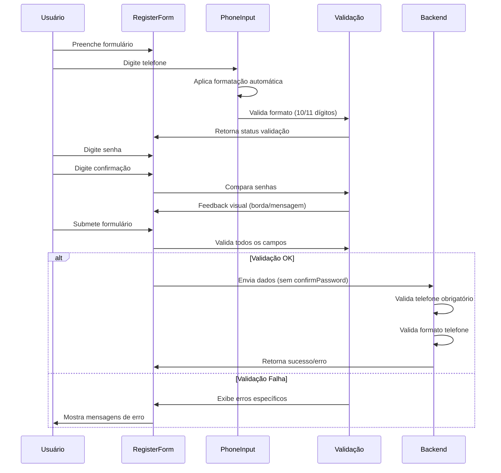

# Documento de Design - Melhorias UX no Cadastro

## Visão Geral

Este design especifica as melhorias na experiência do usuário para o formulário de cadastro, focando em três áreas principais: formatação automática de telefone, validação de confirmação de senha e tornar o telefone obrigatório. O objetivo é criar uma experiência mais intuitiva, segura e livre de erros.

## Arquitetura

### Componentes Envolvidos

```
┌─────────────────────────────────────┐
│           RegisterForm              │
│  ┌─────────────────────────────────┐│
│  │         PhoneInput              ││
│  │  - Formatação automática        ││
│  │  - Validação em tempo real      ││
│  │  - Máscara brasileira           ││
│  └─────────────────────────────────┘│
│  ┌─────────────────────────────────┐│
│  │    Password Confirmation        ││
│  │  - Validação visual             ││
│  │  - Feedback em tempo real       ││
│  │  - Mensagens de erro            ││
│  └─────────────────────────────────┘│
└─────────────────────────────────────┘
           │
           ▼
┌─────────────────────────────────────┐
│        Backend Validation           │
│  - Telefone obrigatório             │
│  - Formato de telefone              │
│  - Limpeza de dados                 │
└─────────────────────────────────────┘
```

### Fluxo de Dados



## Componentes e Interfaces

### 1. PhoneInput Component

**Localização:** `frontend/src/components/common/PhoneInput.tsx`

**Props Interface:**
```typescript
interface PhoneInputProps {
  value: string;
  onChange: (phone: string) => void;
  placeholder?: string;
  required?: boolean;
  className?: string;
}
```

**Funcionalidades:**
- Formatação automática durante digitação
- Validação de 10/11 dígitos
- Máscara brasileira: (XX) XXXX-XXXX ou (XX) 9XXXX-XXXX
- Feedback visual para números inválidos
- Integração com validação do formulário

### 2. RegisterForm Enhancements

**Localização:** `frontend/src/components/auth/RegisterForm.tsx`

**Estado Atualizado:**
```typescript
interface FormData {
  email: string;
  password: string;
  confirmPassword: string; // Novo campo
  name: string;
  phone: string; // Agora obrigatório
}
```

**Validações Frontend:**
```typescript
const validateForm = (data: FormData) => {
  const errors: string[] = [];
  
  // Validação de senhas
  if (data.password !== data.confirmPassword) {
    errors.push('As senhas não coincidem');
  }
  
  if (data.password.length < 6) {
    errors.push('A senha deve ter pelo menos 6 caracteres');
  }
  
  // Validação de telefone
  if (!isValidPhone(data.phone)) {
    errors.push('Telefone deve ter 10 ou 11 dígitos');
  }
  
  return errors;
};
```

### 3. Backend Validation Updates

**Localização:** `backend/server-db.js`

**Validação de Telefone:**
```javascript
// Validação de campos obrigatórios (incluindo telefone)
if (!email || !password || !name || !phone) {
    return res.status(400).json({
        success: false,
        message: 'Email, senha, nome e telefone são obrigatórios',
    });
}

// Validação de formato do telefone
const cleanPhone = phone.replace(/\D/g, '');
if (cleanPhone.length !== 10 && cleanPhone.length !== 11) {
    return res.status(400).json({
        success: false,
        message: 'Telefone deve ter 10 ou 11 dígitos',
    });
}
```

## Modelos de Dados

### FormData Interface
```typescript
interface RegisterFormData {
  email: string;          // Email único do usuário
  password: string;       // Senha (mín. 6 caracteres)
  confirmPassword: string; // Confirmação da senha (não enviada ao backend)
  name: string;           // Nome completo
  phone: string;          // Telefone obrigatório (10/11 dígitos)
}
```

### Backend Request
```typescript
interface RegisterRequest {
  email: string;
  password: string;
  name: string;
  phone: string; // Sem confirmPassword
}
```

## Tratamento de Erros

### 1. Erros de Validação Frontend

**Tipos de Erro:**
- Senhas não coincidem
- Senha muito curta (< 6 caracteres)
- Telefone inválido (não 10/11 dígitos)
- Campos obrigatórios vazios

**Apresentação:**
```typescript
// Feedback visual em tempo real
const getPasswordConfirmClass = () => {
  if (!confirmPassword) return 'border-gray-300';
  return password === confirmPassword 
    ? 'border-green-300' 
    : 'border-red-300';
};

// Mensagens de erro específicas
{confirmPassword && password !== confirmPassword && (
  <p className="mt-1 text-sm text-red-600">
    As senhas não coincidem
  </p>
)}
```

### 2. Erros de Validação Backend

**Códigos de Resposta:**
- `400`: Dados inválidos (campos obrigatórios, formato telefone)
- `409`: Email já existe
- `500`: Erro interno do servidor

**Mensagens Específicas:**
```javascript
const errorMessages = {
  REQUIRED_FIELDS: 'Email, senha, nome e telefone são obrigatórios',
  INVALID_PHONE: 'Telefone deve ter 10 ou 11 dígitos',
  EMAIL_EXISTS: 'Este email já está cadastrado',
  WEAK_PASSWORD: 'A senha deve ter pelo menos 6 caracteres'
};
```

## Estratégia de Testes

### 1. Testes de Componente (PhoneInput)

**Cenários de Teste:**
```typescript
describe('PhoneInput', () => {
  test('formata telefone de 10 dígitos corretamente', () => {
    // Input: '1199887766'
    // Expected: '(11) 9988-7766'
  });
  
  test('formata telefone de 11 dígitos corretamente', () => {
    // Input: '11999887766'
    // Expected: '(11) 99988-7766'
  });
  
  test('valida telefone inválido', () => {
    // Input: '119988776' (9 dígitos)
    // Expected: erro de validação
  });
});
```

### 2. Testes de Formulário (RegisterForm)

**Cenários de Teste:**
```typescript
describe('RegisterForm', () => {
  test('valida confirmação de senha em tempo real', () => {
    // Digitar senhas diferentes
    // Verificar borda vermelha e mensagem de erro
  });
  
  test('impede submissão com senhas diferentes', () => {
    // Tentar submeter com senhas diferentes
    // Verificar que não envia requisição
  });
  
  test('valida telefone obrigatório', () => {
    // Tentar submeter sem telefone
    // Verificar mensagem de erro
  });
});
```

### 3. Testes de Integração (Backend)

**Cenários de Teste:**
```javascript
describe('POST /api/auth/register', () => {
  test('rejeita cadastro sem telefone', async () => {
    const response = await request(app)
      .post('/api/auth/register')
      .send({ email, password, name }); // Sem phone
    
    expect(response.status).toBe(400);
    expect(response.body.message).toContain('telefone são obrigatórios');
  });
  
  test('rejeita telefone com formato inválido', async () => {
    const response = await request(app)
      .post('/api/auth/register')
      .send({ email, password, name, phone: '123456789' }); // 9 dígitos
    
    expect(response.status).toBe(400);
    expect(response.body.message).toContain('10 ou 11 dígitos');
  });
});
```

## Considerações de UX

### 1. Feedback Visual Imediato

**Princípios:**
- Validação em tempo real para reduzir frustração
- Cores consistentes: verde (válido), vermelho (inválido), cinza (neutro)
- Mensagens de erro claras e específicas
- Formatação automática para reduzir carga cognitiva

### 2. Acessibilidade

**Implementações:**
- Labels apropriados para todos os campos
- Atributos `aria-invalid` para campos com erro
- Mensagens de erro associadas aos campos (`aria-describedby`)
- Contraste adequado para mensagens de erro

### 3. Performance

**Otimizações:**
- Debounce na validação de telefone (300ms)
- Validação de confirmação de senha apenas após primeiro blur
- Memoização de funções de formatação
- Validação assíncrona apenas no submit

## Implementação Técnica

### 1. Formatação de Telefone

**Algoritmo:**
```typescript
const formatPhone = (value: string): string => {
  const numbers = value.replace(/\D/g, '');
  
  if (numbers.length <= 10) {
    return numbers.replace(/(\d{2})(\d{4})(\d{4})/, '($1) $2-$3');
  } else {
    return numbers.replace(/(\d{2})(\d{5})(\d{4})/, '($1) $2-$3');
  }
};
```

### 2. Validação de Senha

**Implementação:**
```typescript
const PasswordConfirmation = ({ password, confirmPassword, onChange }) => {
  const [touched, setTouched] = useState(false);
  const isValid = !confirmPassword || password === confirmPassword;
  
  return (
    <div>
      <input
        type="password"
        value={confirmPassword}
        onChange={(e) => onChange(e.target.value)}
        onBlur={() => setTouched(true)}
        className={`${getValidationClass(isValid, touched)}`}
      />
      {touched && !isValid && (
        <ErrorMessage>As senhas não coincidem</ErrorMessage>
      )}
    </div>
  );
};
```

### 3. Integração com Backend

**Preparação de Dados:**
```typescript
const handleSubmit = async (formData: FormData) => {
  // Remove confirmPassword antes de enviar
  const { confirmPassword, ...dataToSend } = formData;
  
  // Limpa formatação do telefone
  dataToSend.phone = dataToSend.phone.replace(/\D/g, '');
  
  const response = await fetch('/api/auth/register', {
    method: 'POST',
    headers: { 'Content-Type': 'application/json' },
    body: JSON.stringify(dataToSend)
  });
};
```

## Métricas de Sucesso

### 1. Métricas de UX
- Redução de erros de cadastro em 40%
- Diminuição do tempo de preenchimento em 25%
- Aumento da taxa de conclusão de cadastro em 15%

### 2. Métricas Técnicas
- Validação frontend captura 95% dos erros antes do submit
- Tempo de resposta da formatação < 100ms
- Zero erros de telefone inválido chegando ao backend

### 3. Métricas de Qualidade
- Cobertura de testes > 90%
- Acessibilidade WCAG 2.1 AA
- Performance Lighthouse > 95