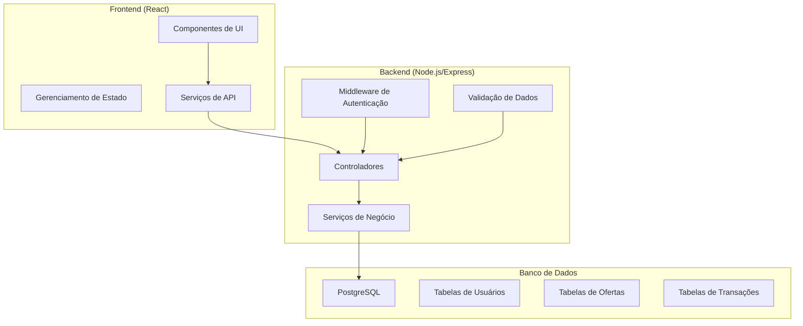

# Documento de Design - Plataforma de Troca de Milhas

## Visão Geral

A Plataforma de Troca de Milhas será desenvolvida como uma aplicação web moderna usando uma arquitetura de três camadas: frontend (React), backend (Node.js/Express), e banco de dados (PostgreSQL). O sistema implementará autenticação JWT, APIs RESTful, e uma interface responsiva para proporcionar uma experiência segura e intuitiva aos usuários.

## Arquitetura

### Arquitetura Geral do Sistema



### Stack Tecnológica

- **Frontend**: React 18, TypeScript, Tailwind CSS, React Router, Axios
- **Backend**: Node.js, Express.js, TypeScript, JWT, bcrypt
- **Banco de Dados**: PostgreSQL com Prisma ORM
- **Autenticação**: JWT (JSON Web Tokens)
- **Validação**: Zod para validação de esquemas
- **Testes**: Jest para testes unitários

## Componentes e Interfaces

### Frontend - Estrutura de Componentes

```
src/
├── components/
│   ├── auth/
│   │   ├── LoginForm.tsx
│   │   ├── RegisterForm.tsx
│   │   └── ProtectedRoute.tsx
│   ├── marketplace/
│   │   ├── OfferList.tsx
│   │   ├── OfferCard.tsx
│   │   ├── OfferFilters.tsx
│   │   └── CreateOfferForm.tsx
│   ├── user/
│   │   ├── UserDashboard.tsx
│   │   ├── UserOffers.tsx
│   │   └── TransactionHistory.tsx
│   └── common/
│       ├── Header.tsx
│       ├── Footer.tsx
│       └── LoadingSpinner.tsx
├── services/
│   ├── authService.ts
│   ├── offerService.ts
│   └── transactionService.ts
├── hooks/
│   ├── useAuth.ts
│   └── useOffers.ts
└── types/
    ├── User.ts
    ├── Offer.ts
    └── Transaction.ts
```

### Backend - Estrutura da API

```
src/
├── controllers/
│   ├── authController.ts
│   ├── offerController.ts
│   ├── transactionController.ts
│   └── userController.ts
├── services/
│   ├── authService.ts
│   ├── offerService.ts
│   ├── transactionService.ts
│   └── emailService.ts
├── middleware/
│   ├── authMiddleware.ts
│   ├── validationMiddleware.ts
│   └── errorHandler.ts
├── models/
│   └── prisma/
│       └── schema.prisma
├── routes/
│   ├── authRoutes.ts
│   ├── offerRoutes.ts
│   ├── transactionRoutes.ts
│   └── userRoutes.ts
└── utils/
    ├── jwt.ts
    ├── validation.ts
    └── constants.ts
```

### Endpoints da API

#### Autenticação
- `POST /api/auth/register` - Registro de usuário
- `POST /api/auth/login` - Login de usuário
- `POST /api/auth/logout` - Logout de usuário
- `GET /api/auth/me` - Obter dados do usuário atual

#### Ofertas
- `GET /api/offers` - Listar todas as ofertas (com filtros)
- `POST /api/offers` - Criar nova oferta
- `GET /api/offers/:id` - Obter oferta específica
- `PUT /api/offers/:id` - Atualizar oferta
- `DELETE /api/offers/:id` - Remover oferta
- `GET /api/offers/user/:userId` - Ofertas de um usuário específico

#### Transações
- `POST /api/transactions` - Iniciar nova transação
- `GET /api/transactions/user` - Transações do usuário atual
- `PUT /api/transactions/:id/status` - Atualizar status da transação
- `GET /api/transactions/:id` - Detalhes de transação específica

#### Usuários
- `GET /api/users/profile` - Perfil do usuário atual
- `PUT /api/users/profile` - Atualizar perfil do usuário

## Modelos de Dados

### Esquema do Banco de Dados (Prisma)

```prisma
model User {
  id        String   @id @default(cuid())
  email     String   @unique
  password  String
  name      String
  phone     String?
  createdAt DateTime @default(now())
  updatedAt DateTime @updatedAt
  
  offers           Offer[]
  buyerTransactions  Transaction[] @relation("BuyerTransactions")
  sellerTransactions Transaction[] @relation("SellerTransactions")
  
  @@map("users")
}

model Airline {
  id    String @id @default(cuid())
  name  String @unique
  code  String @unique
  
  offers Offer[]
  
  @@map("airlines")
}

model Offer {
  id          String      @id @default(cuid())
  title       String
  description String?
  milesAmount Int
  price       Decimal
  type        OfferType   @default(SALE)
  status      OfferStatus @default(ACTIVE)
  createdAt   DateTime    @default(now())
  updatedAt   DateTime    @updatedAt
  
  userId    String
  user      User    @relation(fields: [userId], references: [id])
  airlineId String
  airline   Airline @relation(fields: [airlineId], references: [id])
  
  transactions Transaction[]
  
  @@map("offers")
}

model Transaction {
  id        String            @id @default(cuid())
  status    TransactionStatus @default(PENDING)
  amount    Decimal
  createdAt DateTime          @default(now())
  updatedAt DateTime          @updatedAt
  
  buyerId  String
  buyer    User   @relation("BuyerTransactions", fields: [buyerId], references: [id])
  sellerId String
  seller   User   @relation("SellerTransactions", fields: [sellerId], references: [id])
  offerId  String
  offer    Offer  @relation(fields: [offerId], references: [id])
  
  @@map("transactions")
}

enum OfferType {
  SALE
  EXCHANGE
}

enum OfferStatus {
  ACTIVE
  SOLD
  CANCELLED
}

enum TransactionStatus {
  PENDING
  CONFIRMED
  COMPLETED
  CANCELLED
}
```

### Interfaces TypeScript

```typescript
// User Types
interface User {
  id: string;
  email: string;
  name: string;
  phone?: string;
  createdAt: Date;
  updatedAt: Date;
}

interface CreateUserRequest {
  email: string;
  password: string;
  name: string;
  phone?: string;
}

// Offer Types
interface Offer {
  id: string;
  title: string;
  description?: string;
  milesAmount: number;
  price: number;
  type: 'SALE' | 'EXCHANGE';
  status: 'ACTIVE' | 'SOLD' | 'CANCELLED';
  createdAt: Date;
  updatedAt: Date;
  user: User;
  airline: Airline;
}

interface CreateOfferRequest {
  title: string;
  description?: string;
  milesAmount: number;
  price: number;
  type: 'SALE' | 'EXCHANGE';
  airlineId: string;
}

// Transaction Types
interface Transaction {
  id: string;
  status: 'PENDING' | 'CONFIRMED' | 'COMPLETED' | 'CANCELLED';
  amount: number;
  createdAt: Date;
  updatedAt: Date;
  buyer: User;
  seller: User;
  offer: Offer;
}

// Airline Types
interface Airline {
  id: string;
  name: string;
  code: string;
}
```

## Tratamento de Erros

### Estratégia de Tratamento de Erros

1. **Validação de Entrada**: Usar Zod para validar dados de entrada em todas as rotas
2. **Middleware de Erro Global**: Capturar e formatar erros de forma consistente
3. **Códigos de Status HTTP**: Usar códigos apropriados (400, 401, 403, 404, 500)
4. **Logging**: Registrar erros para monitoramento e debugging
5. **Mensagens de Erro**: Fornecer mensagens claras e seguras para o usuário

### Tipos de Erro

```typescript
interface ApiError {
  message: string;
  code: string;
  statusCode: number;
  details?: any;
}

// Códigos de erro personalizados
enum ErrorCodes {
  VALIDATION_ERROR = 'VALIDATION_ERROR',
  UNAUTHORIZED = 'UNAUTHORIZED',
  FORBIDDEN = 'FORBIDDEN',
  NOT_FOUND = 'NOT_FOUND',
  DUPLICATE_EMAIL = 'DUPLICATE_EMAIL',
  INVALID_CREDENTIALS = 'INVALID_CREDENTIALS',
  OFFER_NOT_AVAILABLE = 'OFFER_NOT_AVAILABLE',
  TRANSACTION_FAILED = 'TRANSACTION_FAILED'
}
```

## Estratégia de Testes

### Testes Frontend
- **Testes de Componente**: React Testing Library para testar componentes isoladamente
- **Testes de Integração**: Testar fluxos completos de usuário
- **Testes de Hooks**: Testar hooks customizados
- **Mocks**: Mockar chamadas de API para testes isolados

### Testes Backend
- **Testes Unitários**: Testar serviços e utilitários isoladamente
- **Testes de Integração**: Testar endpoints da API com banco de dados de teste
- **Testes de Middleware**: Validar autenticação e validação
- **Testes de Modelo**: Validar operações do banco de dados

### Estrutura de Testes

```
tests/
├── frontend/
│   ├── components/
│   ├── hooks/
│   └── services/
├── backend/
│   ├── controllers/
│   ├── services/
│   ├── middleware/
│   └── integration/
└── fixtures/
    ├── users.json
    ├── offers.json
    └── transactions.json
```

### Cobertura de Testes
- Objetivo: Mínimo 80% de cobertura de código
- Foco em lógica de negócio crítica
- Testes de casos extremos e cenários de erro
- Validação de segurança e autenticação